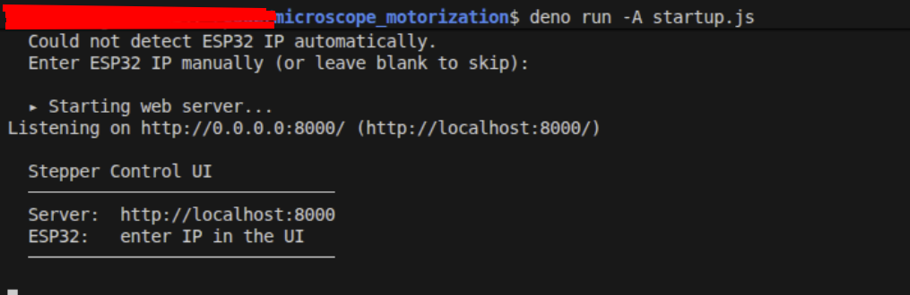
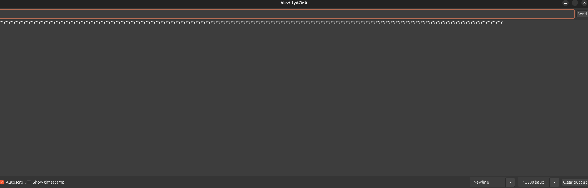
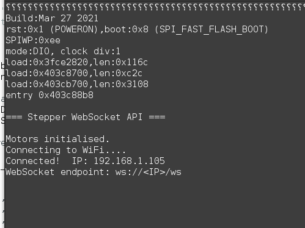

# installation 
## install deno (js)
### mac os / linux 
curl -fsSL https://deno.land/install.sh | sh
### windows
irm https://deno.land/install.ps1 | iex

## run `deno -A startup.js`
## find out ESP32 IP adress
start the serial mointor of the arduino IDE application 

after that , go to http://localhost:8000

if you see question marks, set the correct baud rate and click the 'RET' button on the ESP32
you should see the IP of the ESP32

---

# microscope motorization
this is the software used to run the xy table (z optional ) for the 3d printable microscope motorization
download the 3d printable files here
https://makerworld.com/en/models/2389756-microscope-motorized-xy-table-28byj-48#profileId-2617806

